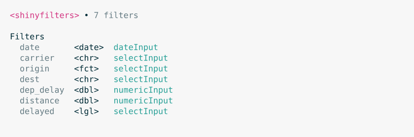

<!-- README.md is generated from README.Rmd. Please edit that file -->

# shinyfilters

<!-- badges: start -->

[](https://CRAN.R-project.org/package=shinyfilters)
[](https://deepwiki.com/joshwlivingston/shinyfilters)
[](https://app.codecov.io/gh/joshwlivingston/shinyfilters)
[](https://CRAN.R-project.org/package=shinyfilters)
[](https://joshwlivingston.r-universe.dev/shinyfilters)
[](https://github.com/joshwlivingston/shinyfilters/actions/workflows/R-CMD-check.yaml)
<!-- badges: end -->

## Overview

*shinyfilters* makes it easy to create Shiny inputs directly from
data.frames.

## Installation

The latest release is available on CRAN:

``` r
# install.packages("pak")
pak::pak("shinyfilters")
```

Or, you can install the development version:

``` r
pak::pak("joshwlivingston/shinyfilters")
```

## Usage

Build interdependent filters in 3 steps:

1.  Create the filters from a data.frame:

``` r
library(shinyfilters)

filters <- shinyfilters(nyc_flights)
filters
```

<picture>
<source media="(prefers-color-scheme: dark)" srcset="man/figures/README-/filters-dark.svg">

</picture> <br>

2.  Place the filters in your ui

``` r
# pak::pak("bslib")
library(bslib)

ui <- page_sidebar(
    sidebar = sidebar(
        filters
    )
)
```

<br>

3.  Place the filters in your server

``` r
server <- function(...) {
    shinyfilters_server(filters)
}
```

<br>

Your app now has interdependent filters!

``` r
library(shiny)
shinyApp(ui, server)
```

<br>

## Customizing filters

`{shinyfilters}` is fully customizable. See
[`vignette("shinyfilters")`](https://joshwlivingston.github.io/shinyfilters/shinyfilters.html)
for a full tour.

<br>
